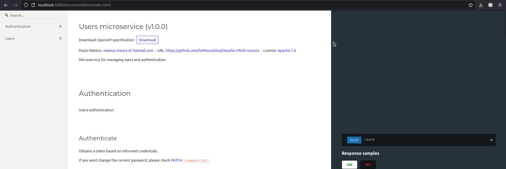
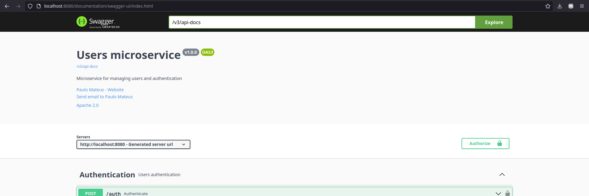
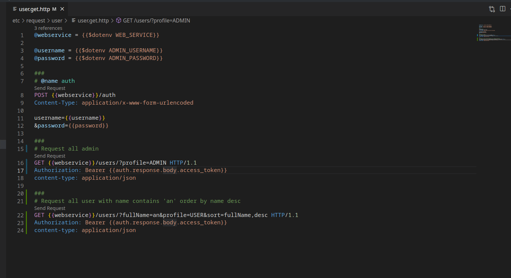
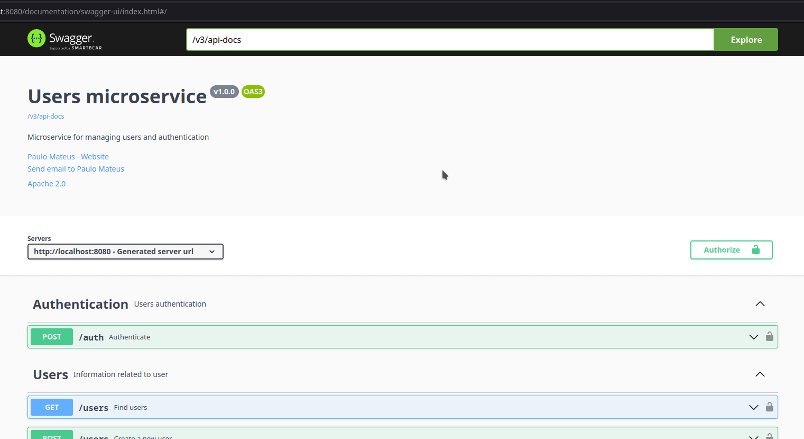
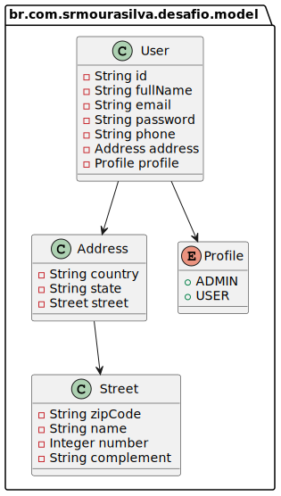

# Desafio CRUD de usuários com MongoDB

Implementação de microsserviço em Spring Boot 2 para gerenciamento de usuários e autenticação.

O processo de autenticação se dá por meio do endpoint `/auth`.
Caso seja informada as credenciais corretas, é retornado um JWT `id_token`, que deverá ser passado
para os endpoints protegidos.
Acesse a [documentação de `/auth`](http://localhost:8080/documentation/index.html#tag/Authentication)

O gerenciamento do usuário se dá por meio dos endpoints `/users`.
Recomenda-se uma consulta a [documentação de `users`](http://localhost:8080/documentation/index.html#tag/Users)
para obter mais detalhes. Note que esses endpoints são todos protegidos, de forma que é necessário informar um token válido.
Usuário sem nível de administrador consegue buscar usuários.
Usuário com nível administrativo possui também permissão para criar, editar e remover usuários.

## Documentação

Para maiores detalhes sobre os endpoints disponibilizados, suba a aplicação e acesse a documentação,
acessível a partir dos seguintes endereços:

 * Redoc: http://localhost:8080/documentation/index.html

 * Swagger-ui: http://localhost:8080/documentation/swagger-ui/index.html


## Execução

Nas subseções a seguir, são disponibilizadas três formas para a execução da aplicação.
Em todas elas, além da aplicação, um banco MongoDB pré-populado também é executado.

Caso deseje, é possível apontar para outro banco por meio das seguintes variáveis de ambiente:
```
MONGODB_HOST=
MONGODB_PORT=
MONGODB_DATABASE=
MONGODB_USERNAME=
MONGODB_PASSWORD=
```

Para customizar as variáveis referentes a autenticação, são disponibilizadas as seguintes variáveis de ambiente.
Recomenda-se ler os comentários de [`application.yml`](src/main/resources/application.yml) para saber mais sobre elas.
Note que ambiente de produção é importante definir outro `TOKEN_SECRET`, caso contrário,
terceiros poderão gerar tokens cujo qual a aplicação considerará válida a partir `TOKEN_SECRET`
de desenvolvimento pré-definido.   
```
TOKEN_AUDIENCE=
TOKEN_TIME_EXPIRATION=
TOKEN_SECRET=
```

A configuração de log está como DEBUG/INFO dado o caráter experimental/educacional.  

### Via Gradle + `docker compose`

Para essa tarefa, é esperado que tenha uma JDK 8 instalado.
O gradle será utilizado para subir a aplicação e o `docker compose`
será utilizado para subir um banco MongoDB. 

> **Nota:** Apesar de não testado, é esperado que a aplicação também seja executada
> adequadamente em um JDK 17.

```bash
# Passo 1 - Subir banco de dados
cd etc/docker
docker compose up -d
# Passo 2 - iniciar aplicação
./gradlew bootRun
# Caso queira definir um JDK específico, defina uma JAVA_HOME
#JAVA_HOME=~/.jdks/temurin-1.8.0_352 ./gradlew bootRun
```

Como alternativa, você pode rodar a partir do `.jar`.
```bash
# Passo 1 - Gerar artefato .jar
# Gera em: build/libs/desafio-0.0.1-SNAPSHOT.jar
./gradlew bootJar
# Caso queira rodar a partir do jar
java -jar build/libs/desafio-0.0.1-SNAPSHOT.jar
# Ou, a partir de uma jre específica
#~/.jdks/temurin-1.8.0_352/jre/bin/java -jar build/libs/desafio-0.0.1-SNAPSHOT.jar
```

### Via Docker + Docker compose

Para criar a imagem, é necessário previamente gerar o `.jar`.
Foi decidido não utilizar um [build multi-estágio](https://docs.docker.com/build/building/multi-stage/)
pois foi considerado que se o build dos artefatos ficasse de fora do build da imagem,
seria mais fácil configurar a ferramenta de CI para aproveitar os artefatos gerados em builds anteriores. 

Consulte o [Dockerfile](./etc/docker/Dockerfile) para saber mais sobre o processo de build.

```bash
# Passo 1 - Gerar artefato .jar
# Gera em: build/libs/desafio-0.0.1-SNAPSHOT.jar
./gradlew bootJar
# Passo 2 - Fazer build da imagem
docker build --file etc/docker/Dockerfile --tag ghcr.io/srmourasilva/desafio-crud-usuario:latest .
# Passo 3 - Subir banco de dados
cd etc/docker
docker compose up -d
# Passo 4 - Iniciar aplicação
# Note que a execução com o banco não será bem suscedida
# se vocẽ não definir o MONGODB_HOST adequado
docker run --rm --name crud -p 8080:8080 \
    --env MONGODB_HOST=192.168.100.44 \
    ghcr.io/srmourasilva/desafio-crud-usuario:latest
```

### Via Kubernetes

Siga os passos para subir a aplicação e o banco no Kubernetes.

> **Nota**: Pra o Kubernetes reconhecer a imagem do webservice, é necessário envia-lo para um registry cujo qual ele tenha acesso. No exemplo abaixo, é considerado que o registry é o `localhost:5000`. Caso você deseje colocar em outro registry, lembre-se de editar o nome da imagem em [etc/kubernetes/webservice-deployment.yaml, linha 30](etc/kubernetes/webservice-deployment.yaml).

```bash
# Passo 1 - Gerar artefato .jar
# Gera em: build/libs/desafio-0.0.1-SNAPSHOT.jar
./gradlew bootJar
# Passo 2 - Fazer build da imagem
docker build --file etc/docker/Dockerfile --tag ghcr.io/srmourasilva/desafio-crud-usuario:latest .
# Passo 3 - Adicionar tag correspondente ao registry que o kubernetes irá utilizar
# Aqui no exemplo, será o localhost:5000
docker tag ghcr.io/srmourasilva/desafio-crud-usuario:latest localhost:5000/srmourasilva/desafio-crud-usuario:latest
# Passo 4 - Enviar imagem para o registry
docker push localhost:5000/srmourasilva/desafio-crud-usuario:latest
# Passo 5 - Subir aplicação
kubectl apply -f etc/kubernetes
# Passo 6 - VocÊ pode fazer um port-foward para ver a aplicação em execução
kubectl port-forward svc/webservice 8080:8080
```

## Testes

Foram implementados testes unitários e testes de integração. Você pode executá-los a partir do comando
```bash
./gradlew test
# ou 
#./gradlew build
```

Note que foi utilizado [testcontainers](https://www.testcontainers.org/) para os testes de integração.
Consequentemente, é esperado que o usuário do computador tenha acesso ao docker para conseguir subir
o container MongoDB durante a execução dos testes.

Adicionalmente, foram preparados scripts de [REST Client](https://marketplace.visualstudio.com/items?itemName=humao.rest-client), 
alternativa ao Postman vs Insomnia. Ao contrário das duas anteriores, REST Clientfacilita o versionamento das requisições.

Caso tenha o vscode instalado, abra-o na pasta `etc/request`, instale as extensões recomendadas e abra os arquivos
de extensão `.http`.
```
code etc/request
```



Outra alternativa seria utilizar o [Swagger-ui](http://localhost:8080/documentation/swagger-ui/index.html) 
para testar os endpoints. Utilize as seguintes credenciais para testar:

| Role    | Username | Password |
|---------| --- | --- |
| `ADMIN` | `admin@example.com` | `S3cretP@ssword` |
| `USER`  | `daniellewilson@williams.com` | `S3cretP@ssword` |



## Decisões de projeto



A senha é codificada utilizando a função de hash [Argon2](https://en.wikipedia.org/wiki/Argon2),
[seguindo as recomendações da OWASP](https://cheatsheetseries.owasp.org/cheatsheets/Password_Storage_Cheat_Sheet.html).
Uma implicação é que a geração de token demora um pouco (entre 1 e 2 segundos).
A implementação utilizada é a disponibilizada pela Spring Security ([Argon2PasswordEncoder](https://docs.spring.io/spring-security/site/docs/current/api/org/springframework/security/crypto/argon2/Argon2PasswordEncoder.html)).

Ainda referente a gestão de senha, nenhum endpoint de usuário retorna a senha codificada.

Conforme especificado, somente usuários administradores podem alterar dados de um usuário.
Desta forma, um usuário não consegue alterar seus próprios dados.

Foi preferido utilizar `PATCH` para atualização parcial de uma entidade ao invés de um `PUT`.
O principal motivador foi evitar que qualquer atualização necessitasse espeficiar uma senha.

## Requisitos do projeto

### Requisitos funcionais

 * [x] Funcionalidades: Autenticação e gerenciamento de usuários
 * [x] Autenticação com e-mail e senha
 * [x] Operações: `CRUD` para dados de um usuário de sistema
   * [x] Cadastro de usuário  
     * [x] Atributos esperados: id, nome, email, senha, endereço, telefone, perfil
   * [x] Busca de usuários
     * [x] pesquisa com filtros, paginação e ordenação dos dados;
   * [x] Edição de usuário
   * [x] Exclusão de usuário
 * [x] Autorização
   * [x] Dois perfis: administrativo (`ADMIN`) e usuário padrão (`USER`);
   * [x] Os recursos devem estar protegidos para que apenas usuários autenticados tenham acesso;
     * [x] Adminstrador pode criar, editar e remover usuários;
     * [x] Usuário padrão pode buscar os dados do usuário.

### Requisitos não funcionais

 * [x] Disponibilização do código em repositório de código aberto (Github);
 * [x] Tecnologias
   * [x] Spring Boot;
   * [x] Spring Security;
   * [x] MongoDB;
 * [x] Cobertura de testes;
 * [x] Build de container em imagem docker;
 * [x] YAML para Kubernetes;
 * [x] Reprodutibilidade: Documentação do processo de geração de imagem e de execução;

### Adicionais

Além do solicitado, os seguintes pontos complementares foram incluídos:

 * [x] Documentação com o Redoc;
 * [x] Testes de integração.

### Outras restrições

 * [x] Java 8;
 * [x] Spring Boot 2.x.

## Pontos de melhoria

Como evolução desse projeto, sugere-se:

 * [ ] Spring Boot 3 com Java 17 ou Kotlin;
 * [ ] Criação de JREs com o mínimo necessário (necessário Java >= 9);
 * [ ] Autenticação:
   * [ ] OpenID Connect 1.0 por meio do [Spring Authorization Server](https://spring.io/projects/spring-authorization-server) (necessário Spring Boot 3);
   * [ ] Ou integração com IdP externa, como o Keycloak, o Amazon Cognito ou o Google Identity Provider;
 * Paginação com QueryDSL.
